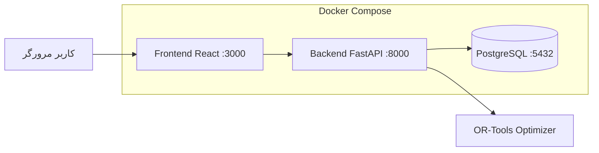
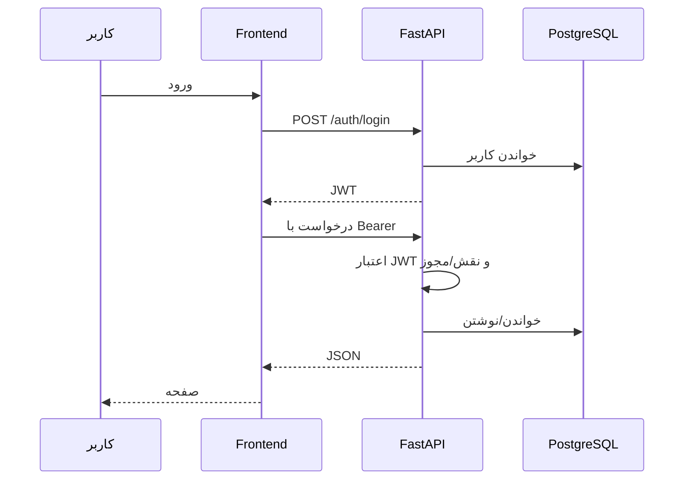
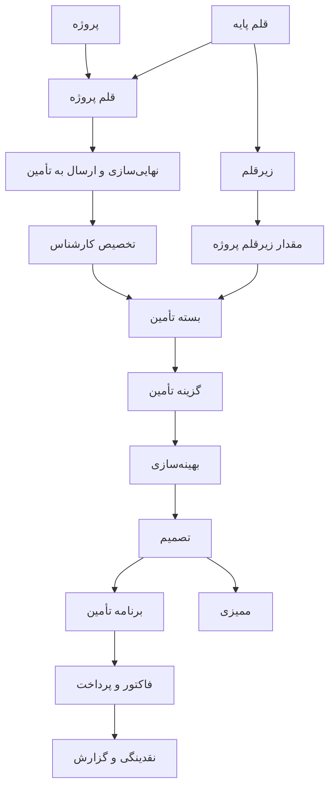
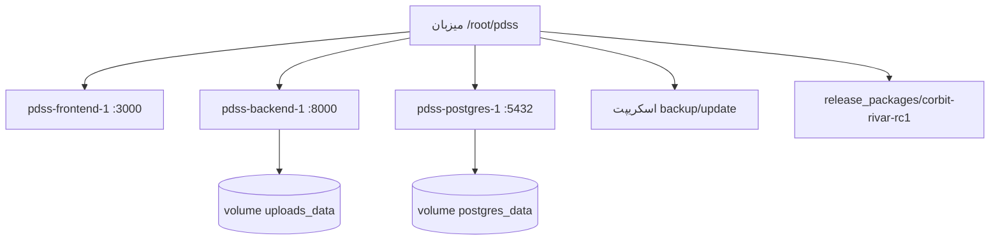

# معماری محصول Rivar

این توضیح برای ارزیاب نوشته شده است: دقیق، اما بدون ادعاهای پیاده‌نشده.

## ۱. معماری سطح بالا

Rivar یک سامانه تصمیم‌یار تأمین پروژه‌ای و بهینه‌سازی نقدینگی است.

اجزای واقعی محیط فعلی:

- مرورگر کاربر → Frontend React روی پورت ۳۰۰۰
- Frontend با axios و JWT به Backend FastAPI روی پورت ۸۰۰۰ می‌زند
- Backend با SQLAlchemy async روی PostgreSQL می‌نویسد/می‌خواند
- هر سه جزء با Docker Compose بالا می‌آیند
- اسکریپت‌های backup/update و بسته RC1 کنار محصول هستند

## ۲. جریان درخواست

1. کاربر در `/login` نام کاربری و رمز می‌دهد.
2. `POST /auth/login` کاربر را با hash بررسی می‌کند و JWT می‌سازد.
3. Frontend توکن را در `localStorage` می‌گذارد و در header `Authorization: Bearer` می‌فرستد.
4. `get_current_user` توکن را باز می‌کند و کاربر را از جدول `users` می‌خواند.
5. مسیر، نقش قدیمی و در برخی ماژول‌ها کلید مجوز RBAC را چک می‌کند.
6. سرویس/CRUD روی PostgreSQL کار می‌کند.
7. داشبورد و گزارش‌ها روی همان داده‌ها aggregation می‌سازند.

## ۳. جریان داده کسب‌وکار

ترتیب واقعی که کد و UI پشتیبانی می‌کنند:

1. تعریف پروژه (`projects`)
2. تعریف قلم پایه و زیرقلم (`items_master`, `item_subitems`)
3. تعریف قلم پروژه و مقدار (`project_items`, `project_item_subitems`)
4. تعریف گزینه تحویل/قیمت فروش (`delivery_options`)
5. نهایی‌سازی قلم در صورت واجد شرایط بودن (`items/{id}/finalize`)
6. تخصیص کارشناس تأمین (`procurement_assignments`)
7. ساخت بسته و گزینه تأمین (`procurement_packages`, `procurement_options`)
8. محاسبه پوشش زیرقلم (`package_subitems`, `/packages/coverage/{id}`)
9. ارسال به بهینه‌سازی / اجرای solver (`optimization_submissions`, `POST /finance/optimize-enhanced`)
10. پیشنهاد و قفل تصمیم (`finalized_decisions`)
11. برنامه تأمین: تأیید تحویل و پذیرش PM (`procurement-plan`)
12. فاکتور، دریافت، پرداخت تأمین‌کننده
13. رویداد نقدینگی و داشبورد/گزارش
14. ثبت ممیزی (`audit_logs`)

## ۴. معماری بسته و پوشش

- قلم والد: `ProjectItem` به `ItemMaster` وصل است.
- اجزا: `ItemSubItem` روی کاتالوگ؛ مقدار موردنیاز در `ProjectItemSubItem`.
- بسته تأمین: `ProcurementPackage` از نوع `FULL` / `PARTIAL` / `CUSTOM`.
- پوشش: `PackageSubItem.quantity_covered` و `coverage_percentage`.
- پوشش ناقص برای نمایش تصمیم‌گیری مفید است؛ قفل تصمیم وقتی هر دو flag زیر روشن باشند جلوی lock ناقص را می‌گیرد:
  - `ENABLE_PACKAGE_PROCUREMENT`
  - `ENFORCE_PACKAGE_COVERAGE_ON_LOCK`
- تابع: `validate_package_coverage_for_lock` در `backend/app/services/package_service.py`
- در compose فعلی این flagها پیش‌فرض خاموش‌اند. پس lock اجباری پوشش را باید با کد/تست/flag نشان داد، مگر flag روشن شود.

## ۵. معماری مالی و نقدینگی

ورودی‌ها:

- فاکتور مشتری: جدول `invoices` و مسیر `/api/invoice-payment`
- دریافت: جدول `payments`
- پرداخت به تأمین‌کننده: `supplier_payments`
- بودجه دوره‌ای: `budget_data`
- رویداد نقدینگی: `cashflow_events` با همگام‌سازی `cashflow_sync_service.py`

خروجی‌ها:

- `GET /dashboard/cashflow` و `/dashboard/summary`
- `GET /reports/` و خروجی اکسل
- `GET /analytics/eva/{project_id}` و پیش‌بینی/ریسک

موتور بهینه‌سازی هزینه/زمان/بودجه را برای انتخاب گزینه حل می‌کند؛ تحلیل بودجه جدا از solver در `budget_analysis_service.py` است.

## ۶. امنیت و دسترسی

- ورود JWT، نه session cookie
- نقش‌های بذر: `admin`, `pmo`, `pm`, `procurement`, `finance`
- مدل RBAC جدا: `roles`, `permissions`, `user_roles`
- منوی frontend با نقش و helperهای `frontend/src/utils/permissions.ts` فیلتر می‌شود
- Audit login در `POST /auth/login`
- مشاهده لاگ ممیزی: `GET /audit-logs/` برای admin

محدودیت صادقانه: `enable_permission_enforcement` پیش‌فرض false است. ادعا نکنید «هر API با RBAC ریزدانه اجباری است».

## ۷. معماری استقرار

ایمنی به‌روزرسانی:

- volume دیتابیس جدا از کانتینر است؛ `down -v` داده‌ها را پاک می‌کند و نباید استفاده شود.
- اسکریپت‌های backup قبل از update در `scripts/*/deployment/` وجود دارند.
- بسته RC1 و installer در `deployment/rivar-installer/` مسیر نصب/verify دارند.
- rollback کامل خودکار محصول به‌عنوان دکمه UI وجود ندارد؛ rollback عملیاتی از backup و جایگزینی سورس است.

Frontend فعلی در این استک با `npm start` اجرا می‌شود. README نصب‌کننده ممکن است nginx را ذکر کند؛ این اختلاف را باید گفت.
